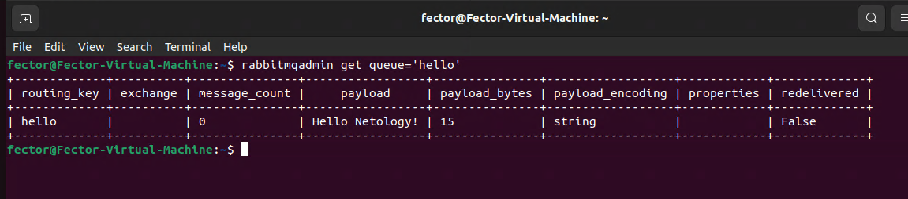

# Домашнее задание к занятию  «Очереди RabbitMQ»
---

### Задание 1. Установка RabbitMQ

Используя Vagrant или VirtualBox, создайте виртуальную машину и установите RabbitMQ.
Добавьте management plug-in и зайдите в веб-интерфейс.

*Итогом выполнения домашнего задания будет приложенный скриншот веб-интерфейса RabbitMQ.*

---


### Задание 2. Отправка и получение сообщений

Используя приложенные скрипты, проведите тестовую отправку и получение сообщения.
Для отправки сообщений необходимо запустить скрипт producer.py.

Для работы скриптов вам необходимо установить Python версии 3 и библиотеку Pika.
Также в скриптах нужно указать IP-адрес машины, на которой запущен RabbitMQ, заменив localhost на нужный IP.

```shell script
$ pip install pika
```

Зайдите в веб-интерфейс, найдите очередь под названием hello и сделайте скриншот.
После чего запустите второй скрипт consumer.py и сделайте скриншот результата выполнения скрипта

*В качестве решения домашнего задания приложите оба скриншота, сделанных на этапе выполнения.*

Для закрепления материала можете попробовать модифицировать скрипты, чтобы поменять название очереди и отправляемое сообщение.

---


### Задание 3. Подготовка HA кластера

Используя Vagrant или VirtualBox, создайте вторую виртуальную машину и установите RabbitMQ.
Добавьте в файл hosts название и IP-адрес каждой машины, чтобы машины могли видеть друг друга по имени.

Пример содержимого hosts файла:
```shell script
$ cat /etc/hosts
192.168.0.10 rmq01
192.168.0.11 rmq02
```
После этого ваши машины могут пинговаться по имени.

Затем объедините две машины в кластер и создайте политику ha-all на все очереди.

*В качестве решения домашнего задания приложите скриншоты из веб-интерфейса с информацией о доступных нодах в кластере и включённой политикой.*


Также приложите вывод команды с двух нод:

```shell script
$ rabbitmqctl cluster_status
```


Для закрепления материала снова запустите скрипт producer.py и приложите скриншот выполнения команды на каждой из нод:

```shell script
$ rabbitmqadmin get queue='hello'
```




После чего попробуйте отключить одну из нод, желательно ту, к которой подключались из скрипта, затем поправьте параметры подключения в скрипте consumer.py на вторую ноду и запустите его.

*Приложите скриншот результата работы второго скрипта.*


## Дополнительные задания (со звёздочкой*)
Эти задания дополнительные, то есть не обязательные к выполнению, и никак не повлияют на получение вами зачёта по этому домашнему заданию. Вы можете их выполнить, если хотите глубже шире разобраться в материале.

### * Задание 4. Ansible playbook

Напишите плейбук, который будет производить установку RabbitMQ на любое количество нод и объединять их в кластер.
При этом будет автоматически создавать политику ha-all.

*Готовый плейбук разместите в своём репозитории.*

```yaml
---
- name: Установка RabbitMQ
  hosts: rabbitmq_nodes
  become: true
  tasks:
    - name: Обновить /etc/hosts
      lineinfile:
        path: /etc/hosts
        regexp: "^{{ hostvars[item]['ansible_host'] }}"
        line: "{{ hostvars[item]['ansible_host'] }} {{ item }}"
        state: present
      with_items: "{{ groups['rabbitmq_nodes'] }}"

    - name: Установить rabbitmq-server
      apt:
        name: rabbitmq-server
        state: present
        update_cache: yes

    - name: Задать имя узла
      lineinfile:
        path: /etc/rabbitmq/rabbitmq-env.conf
        line: "NODENAME=rabbit@{{ inventory_hostname }}"
        create: yes
        owner: rabbitmq
        group: rabbitmq
        mode: '0644'

    - name: Установить Erlang cookie
      copy:
        content: "{{ erlang_cookie }}"
        dest: /var/lib/rabbitmq/.erlang.cookie
        owner: rabbitmq
        group: rabbitmq
        mode: '0400'

    - name: Перезапустить RabbitMQ
      systemd:
        name: rabbitmq-server
        state: restarted
        enabled: yes

    - name: Ожидать готовности
      command: rabbitmqctl await_startup

- name: Присоединение к кластеру
  hosts: rabbitmq_nodes
  become: true
  serial: 1
  vars:
    master: "{{ groups['rabbitmq_nodes'][0] }}"

  tasks:
    - name: Проверить в кластере
      shell: "rabbitmqctl cluster_status | grep \"'rabbit@{{ inventory_hostname }}'\""
      register: in_cluster
      failed_when: false
      changed_when: false

    - name: Присоединить к кластеру
      block:
        - command: rabbitmqctl stop_app
        - command: rabbitmqctl reset
        - command: "rabbitmqctl join_cluster rabbit@{{ master }}"
        - command: rabbitmqctl start_app
      when:
        - inventory_hostname != master
        - in_cluster.rc != 0

    - name: Включить плагин управления
      command: rabbitmq-plugins enable rabbitmq_management
      register: plugin_result
      changed_when: "'already enabled' not in plugin_result.stdout"

    - name: Задать политику ha-all
      command: rabbitmqctl set_policy ha-all ".*" '{"ha-mode":"all", "ha-sync-mode":"automatic"}'
      when: inventory_hostname == master
      changed_when: false
```
```
[rabbitmq_nodes]
rmqq01 ansible_host=172.22.163.174 ansible_user=fector
rmqq02 ansible_host=172.22.172.226 ansible_user=fedor
rmqq03 ansible_host=172.22.163.205 ansible_user=test

[all:vars]
erlang_cookie = "TEST_RABBITMQ_COOKIE_FOR_CLUSTER"
```
